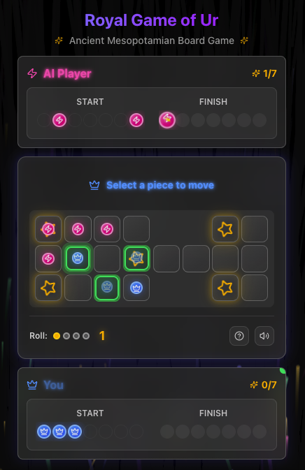

# 🏺 Royal Game of Ur - Cloudflare Edition

A modern implementation of the ancient Mesopotamian board game, "The Royal Game of Ur," built with Next.js and TypeScript, and powered by a unique dual AI engine written in Rust.

This project is a Progressive Web App (PWA), allowing for installation on your device for a native-like experience with offline capabilities.

[](https://github.com/rgilks/rgou-cloudflare/actions/workflows/deploy.yml)



<div align="center">
  <a href='https://ko-fi.com/N4N31DPNUS' target='_blank'></a>
</div>

## 🌟 Features

- **Authentic Gameplay**: A faithful recreation of the 4,500-year-old Royal Game of Ur.
- **Dual AI Engine**:
  - **Cloud AI**: A high-performance Rust AI deployed on Cloudflare Workers for deep strategic analysis.
  - **Client AI**: The same core Rust AI logic is compiled to WebAssembly (Wasm) and runs in the browser for offline play and instant responses.
- **PWA & Offline Ready**: Installable as a Progressive Web App with client-side AI for full offline gameplay.
- **Modern UI/UX**: A beautiful, responsive interface built with React, Tailwind CSS, and Framer Motion animations.
- **Real-time Gameplay**: Smooth animations and real-time game state updates with sound effects.
- **Detailed Game Analytics**: The AI provides detailed insights into its decision-making process.

## 🎯 Game Rules

The Royal Game of Ur is a race game where each player tries to move all 7 of their pieces around the board and off the finish before their opponent.

- **Dice**: Roll 4 tetrahedral dice (binary dice). The number of marked corners facing up determines the number of squares you can move (0-4).
- **Movement**: Move pieces along your designated track from the start to the finish.
- **Combat**: Landing on a square occupied by an opponent's piece sends it back to the start. This does not apply to squares with a rosette.
- **Rosettes**: The starred squares are safe zones and grant an extra turn.
- **Winning**: The first player to move all 7 of their pieces off the board wins.

## 🏗️ Architecture

This project uses a unique dual-AI architecture, allowing the user to switch seamlessly between a powerful server-side AI and an instant client-side AI. The core AI logic is shared in the `worker/rust_ai_core` crate, ensuring consistent AI behavior across both platforms.

- **Server AI**: A Rust AI on **Cloudflare Workers**. Due to the short compute time limits of serverless functions, this AI has a lower search depth, making it a faster but weaker opponent.
- **Client AI**: The same core Rust AI logic compiled to **WebAssembly (Wasm)** runs directly in the browser. It uses a deeper search, making it the **stronger** opponent. This also enables **offline play**.

For a more detailed explanation of the architecture, please see the [Architecture Overview](./docs/architecture-overview.md) document.

## 🛠️ Tech Stack

- **Frontend**: Next.js, React, TypeScript, Tailwind CSS
- **PWA**: Service Worker, Web App Manifest
- **AI Engine**: Rust (Cloudflare Worker) & Rust compiled to WebAssembly (Client)
- **Deployment**: Cloudflare Pages & Workers

## 🚀 Getting Started

### Prerequisites

- Node.js 18+ and npm
- Rust and Cargo
- A Cloudflare account for deployment

### Development Setup

1.  **Clone the repository and install dependencies:**

    ```bash
    git clone <repository-url>
    cd rgou-cloudflare
    npm install
    ```

2.  **Start the development server:**
    This will start the Next.js app and a local AI worker.

    ```bash
    npm run dev
    ```

3.  **Open your browser** and navigate to `http://localhost:3000`.

### Available Scripts

- `npm run dev`: Start the Next.js development server.
- `npm run build`: Build the application for production.
- `npm run start`: Start a production server.
- `npm run deploy:worker`: Deploy the AI worker to Cloudflare.
- `npm run lint`: Run ESLint.
- `npm run check`: Run Prettier, ESLint, and TypeScript type checking.
- `npm run migrate:d1`: Apply database migrations to the production D1 database.

## 📂 Project Structure

```
rgou-cloudflare/
├── src/
│   ├── app/                    # Next.js app router pages
│   ├── components/             # React components
│   └── lib/                    # Core application logic
│       ├── wasm/               # Client-side Wasm AI
│       ├── ai-service.ts       # Server-side AI API client
│       ├── wasm-ai-service.ts  # Client-side Wasm AI service
│       └── game-logic.ts       # Core game rules
├── public/
│   └── wasm/                   # Wasm assets served to the browser
├── worker/                     # Server-side AI worker
│   ├── rust_ai_core/           # Core Rust AI logic (shared with client)
│   └── src/                    # Worker-specific Rust code
├── docs/                       # Project documentation
└── ...                         # Configuration files
```

## 🚀 Deployment

This project is designed for a seamless deployment experience to the Cloudflare ecosystem, leveraging OpenNext to adapt the Next.js application for Cloudflare Pages.

### Building for Production

To create a production-ready build, run the following command:

```bash
npm run build
```

This command uses the `@opennextjs/cloudflare` adapter to compile the Next.js application and package it into the `.open-next` directory, which is optimized for deployment on Cloudflare. This single command handles both the frontend application and the WebAssembly assets.

### Local Deployment from Your Machine

You can deploy the application directly from your local machine using the Cloudflare Wrangler CLI.

1.  **Ensure you are logged in to Wrangler:**
    ```bash
    npx wrangler login
    ```
2.  **Build the application:**
    ```bash
    npm run build
    ```
3.  **Deploy the application:**
    ```bash
    npx wrangler deploy
    ```
    This command will upload the contents of the `.open-next` directory to Cloudflare Pages.

### Automated Deployment with GitHub Actions

Deployment is automated via a GitHub Actions workflow defined in `.github/workflows/deploy.yml`. The workflow is triggered on every push to the `main` branch and performs the following steps:

1.  Checks out the code.
2.  Sets up Node.js and Rust environments.
3.  Installs dependencies.
4.  Builds the application using `npm run build`.
5.  Deploys to Cloudflare using the `wrangler-action`.

## 📚 Historical Context

The Royal Game of Ur dates back to 2600-2400 BCE and was discovered in the Royal Cemetery at Ur by Sir Leonard Woolley. The game's rules were deciphered from a cuneiform tablet by Irving Finkel at the British Museum.

## 🙏 Acknowledgements

- **Cloudflare** for their powerful Workers platform.
- **Vercel** for their excellent Next.js tooling and inspiration.
- The **Rust community** for outstanding WebAssembly support.
- The **Ancient Mesopotamians** for creating this timeless game.

## 📝 License

This project is licensed under the MIT License.
