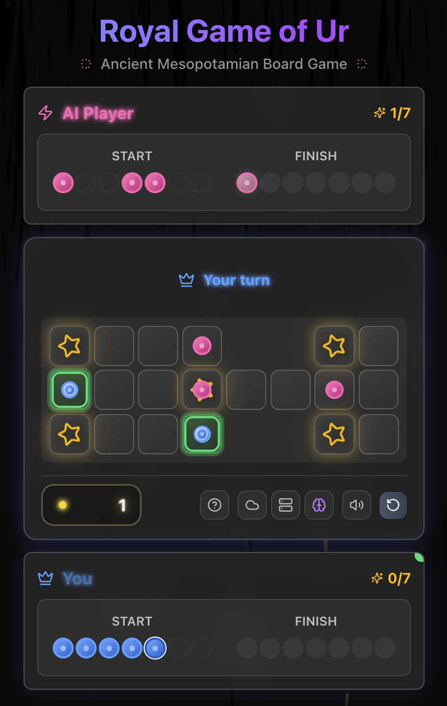

# 🏺 Royal Game of Ur - Cloudflare Edition

A modern implementation of the ancient Mesopotamian board game, "The Royal Game of Ur," built with Next.js and TypeScript, and powered by a unique dual AI engine written in Rust.

This project is a Progressive Web App (PWA), allowing for installation on your device for a native-like experience with offline capabilities.

[](https://github.com/rgilks/rgou-cloudflare/actions/workflows/deploy.yml)

<div align="center">
  
</div>

<div align="center">
  <a href='https://ko-fi.com/N4N31DPNUS' target='_blank'></a>
</div>

## 🌟 Features

- **Authentic Gameplay**: A faithful recreation of the 4,500-year-old Royal Game of Ur.
- **Dual AI Engine**:
  - **Client AI (Default)**: A high-performance Rust AI compiled to WebAssembly, running in the browser for instant responses and offline play. Uses expectiminimax algorithm with 6-ply search depth.
  - **Server AI (Fallback)**: The same core Rust AI logic deployed on Cloudflare Workers for consistent performance. Uses 4-ply search depth for faster response times.
- **PWA & Offline Ready**: Installable as a Progressive Web App with client-side AI for full offline gameplay.
- **Modern UI/UX**: A beautiful, responsive interface built with React, Tailwind CSS, and Framer Motion animations.
- **Real-time Gameplay**: Smooth animations and real-time game state updates with immersive sound effects.
- **Celebration Effects**: Dynamic visual celebrations with screen shake, particle explosions, and triumphant sounds when pieces reach home.
- **Intuitive Controls**: AI pieces are non-interactive, preventing accidental clicks and ensuring clear game flow.
- **Detailed Game Analytics**: The AI provides detailed insights into its decision-making process.
- **Game Statistics**: Track your wins, losses, and win rate across all games played.

## 🎯 Game Rules

The Royal Game of Ur is a 4,500-year-old race game where each player tries to move all 7 pieces around the board and off the finish before their opponent.

**Quick Rules:**

- **Dice**: Roll 4 tetrahedral dice (binary dice). Count marked corners facing up (0-4).
- **Movement**: Move pieces along your designated track from start to finish.
- **Combat**: Landing on an opponent's piece sends it back to start (except on rosette squares).
- **Rosettes**: Starred squares are safe zones and grant an extra turn.
- **Winning**: First player to move all 7 pieces off the board wins.

For complete rules, historical context, and strategic guidance, see the [Game Rules and Strategy Guide](./docs/game-rules-strategy.md).

## 🏗️ Architecture

This project uses a unique dual-AI architecture, allowing the user to switch seamlessly between a server-side and client-side AI. The core AI logic is shared in the `worker/rust_ai_core` crate, ensuring consistent AI behavior across both platforms. At present only the client AI is used in production as it's cheaper to run.

- **Client AI (Default)**: The same core Rust AI logic compiled to **WebAssembly (Wasm)** runs directly in the browser. It uses a deeper search (6 plies), making it the **stronger** opponent. This also enables **offline play**.
- **Server AI (Fallback)**: A Rust AI on **Cloudflare Workers**. Due to the short compute time limits of serverless functions, this AI has a lower search depth (4 plies), making it a faster but weaker opponent.

### AI Algorithm

The AI uses the **Expectiminimax** algorithm, an extension of minimax for games with chance elements (dice rolls). It combines:

- **Minimax search** for deterministic game states
- **Expectation nodes** for probabilistic dice roll outcomes
- **Alpha-beta pruning** for search optimization
- **Transposition tables** for position caching
- **Quiescence search** to avoid horizon effects

For detailed technical information about the AI system, evaluation function, and academic references, see the [AI System Documentation](./docs/ai-system.md).

For a more detailed explanation of the overall architecture, please see the [Architecture Overview](./docs/architecture-overview.md) document.

## 🛠️ Tech Stack

- **Frontend**: Next.js, React, TypeScript, Tailwind CSS
- **PWA**: Service Worker, Web App Manifest
- **AI Engine**: Rust (Cloudflare Worker) & Rust compiled to WebAssembly (Client)
- **Deployment**: Cloudflare Workers

## 📚 Documentation

- **[Documentation Index](./docs/README.md)**: Complete guide to all documentation
- **[Architecture Overview](./docs/architecture-overview.md)**: Detailed system architecture and component interactions
- **[AI System Documentation](./docs/ai-system.md)**: Comprehensive guide to the AI algorithm, evaluation function, and technical implementation
- **[Technical Implementation Guide](./docs/technical-implementation.md)**: Development setup, build process, and technical details
- **[Game Rules and Strategy](./docs/game-rules-strategy.md)**: Complete rules, historical context, and strategic guidance
- **[Game Statistics](./docs/game-statistics.md)**: Information about the statistics tracking system

## 🚀 Getting Started

### Prerequisites (Install These First!)

Before you begin, make sure you have the following installed on your computer:

- **Git** – to clone the project ([Download Git](https://git-scm.com/downloads))
- **Node.js (v18+) & npm** – JavaScript runtime and package manager ([Download Node.js](https://nodejs.org/))
- **Rust & Cargo** – for building the AI ([Install Rust](https://www.rust-lang.org/tools/install))
- **wasm-pack** – for building WebAssembly packages:
  ```bash
  cargo install wasm-pack
  ```
- **worker-build** – for bundling Rust-based Cloudflare Workers:
  ```bash
  cargo install worker-build
  ```
- **SQLite** – for local database (most systems have it, or [Download SQLite](https://www.sqlite.org/download.html))

### 1. Check Out the Project

Clone the repository from GitHub:

```bash
git clone <repository-url>
cd rgou-cloudflare
```

### 2. Local Development (with Database)

Follow these steps to get the game running locally, including saving data to the database. No advanced skills required!

1. **Install dependencies**

   ```bash
   npm install
   ```

2. **Set up the local database**
   - The game uses SQLite for local development. All your game data will be saved in a file called `local.db` in the project folder.
   - Run this command to create/update the database:

   ```bash
   npm run migrate:local
   ```

3. **Start the development server**

   ```bash
   npm run dev
   ```

   - The game will open at http://localhost:3000 (or another port if 3000 is busy).
   - You can now play, and your game results will be saved to `local.db` automatically.

4. **(Optional) Inspect your data**
   - You can open `local.db` with any free SQLite browser (e.g. [DB Browser for SQLite](https://sqlitebrowser.org/)).

### 3. Deploy to Cloudflare

To host your game on Cloudflare Pages and Workers:

#### Prerequisites for Deployment

- **Cloudflare Account** – Sign up at [cloudflare.com](https://cloudflare.com)
- **Wrangler CLI** – Install the Cloudflare CLI tool:
  ```bash
  npm install -g wrangler
  ```

#### Setup Steps

1. **Login to Cloudflare**

   ```bash
   wrangler login
   ```

2. **Create a D1 Database**
   - Go to your Cloudflare dashboard
   - Navigate to "Workers & Pages" → "D1"
   - Click "Create database"
   - Name it `rgou-db` (or any name you prefer)
   - Copy the database ID

3. **Configure Environment Variables**
   - Create a `.env.local` file in your project root:

   ```bash
   # Add your Cloudflare account ID (find this in your dashboard)
   CLOUDFLARE_ACCOUNT_ID=your_account_id_here

   # Add your D1 database ID
   D1_DATABASE_ID=your_database_id_here
   ```

4. **Update wrangler.toml**
   - Open `wrangler.toml` and update the `account_id` and `database_id` with your values

5. **Deploy the Database Schema**

   ```bash
   npm run migrate:d1
   ```

6. **Deploy the Application**

   ```bash
   npm run build
   npx wrangler deploy
   ```

### 4. Set Up GitHub Actions (Automatic Deployment)

For automatic deployment when you push to GitHub:

#### Prerequisites

- **GitHub Repository** – Your code must be in a GitHub repository
- **Cloudflare API Token** – Create one in your Cloudflare dashboard

#### Setup Steps

1. **Create Cloudflare API Token**
   - Go to your Cloudflare dashboard → "My Profile" → "API Tokens"
   - Click "Create Token"
   - Use "Custom token" template
   - Add these permissions:
     - **Account** → **Cloudflare Pages** → **Edit**
     - **Account** → **Workers Scripts** → **Edit**
     - **Zone** → **Zone** → **Read** (if using custom domain)
   - Copy the token

2. **Add GitHub Secrets**
   - Go to your GitHub repository → "Settings" → "Secrets and variables" → "Actions"
   - Add these secrets:
     - `CLOUDFLARE_API_TOKEN` = Your API token from step 1
     - `CLOUDFLARE_ACCOUNT_ID` = Your Cloudflare account ID

3. **Push to GitHub**
   - The workflow is already configured in `.github/workflows/deploy.yml`
   - Simply push to the `main` branch:

   ```bash
   git add .
   git commit -m "Initial deployment"
   git push origin main
   ```

4. **Monitor Deployment**
   - Go to your GitHub repository → "Actions" tab
   - You'll see the deployment progress
   - The workflow will:
     - Build the application
     - Deploy to Cloudflare Pages
     - Deploy the AI worker

Now every time you push to `main`, your game will automatically deploy to Cloudflare!

### Development Setup

1.  **Clone the repository and install dependencies:**

    ```bash
    git clone <repository-url>
    cd rgou-cloudflare
    npm install
    ```

2.  **Start the development server:**
    This will start the Next.js app and a local AI worker.

    ```bash
    npm run dev
    ```

3.  **Open your browser** and navigate to `http://localhost:3000`.

### Available Scripts

- `npm run dev`: Start the Next.js development server.
- `npm run build`: Build the application for production.
- `npm run start`: Start a production server.
- `npm run deploy:worker`: Deploy the AI worker to Cloudflare. This script is primarily for development purposes to quickly update the server-side AI without triggering a full application deployment. The automated GitHub Actions workflow handles the production deployment.
- `npm run lint`: Run ESLint.
- `npm run check`: Run Prettier, ESLint, and TypeScript type checking.
- `npm run migrate:d1`: Apply database migrations to the production D1 database.

## 📂 Project Structure

```
rgou-cloudflare/
├── src/
│   ├── app/                    # Next.js app router pages
│   ├── components/             # React components
│   └── lib/                    # Core application logic
│       ├── wasm/               # Client-side Wasm AI
│       ├── ai-service.ts       # Server-side AI API client
│       ├── wasm-ai-service.ts  # Client-side Wasm AI service
│       └── game-logic.ts       # Core game rules
├── public/
│   └── wasm/                   # Wasm assets served to the browser
├── worker/                     # Server-side AI worker
│   ├── rust_ai_core/           # Core Rust AI logic (shared with client)
│   └── src/                    # Worker-specific Rust code
├── docs/                       # Project documentation
└── ...                         # Configuration files
```

## 🚀 Deployment

This project is designed for a seamless deployment experience to the Cloudflare ecosystem, leveraging OpenNext to adapt the Next.js application for Cloudflare Pages.

### Building for Production

To create a production-ready build, run the following command:

```bash
npm run build
```

This command uses the `@opennextjs/cloudflare` adapter to compile the Next.js application and package it into the `.open-next` directory, which is optimized for deployment on Cloudflare. This single command handles both the frontend application and the WebAssembly assets.

### Local Deployment from Your Machine

You can deploy the application directly from your local machine using the Cloudflare Wrangler CLI.

1.  **Ensure you are logged in to Wrangler:**
    ```bash
    npx wrangler login
    ```
2.  **Build the application:**
    ```bash
    npm run build
    ```
3.  **Deploy the application:**
    ```bash
    npx wrangler deploy
    ```
    This command will upload the contents of the `.open-next` directory to Cloudflare Pages.

### Automated Deployment with GitHub Actions

Deployment is automated via a GitHub Actions workflow defined in `.github/workflows/deploy.yml`. The workflow is triggered on every push to the `main` branch and performs the following steps:

1.  Checks out the code.
2.  Sets up Node.js and Rust environments.
3.  Installs dependencies.
4.  Builds the application using `npm run build`.
5.  Deploys to Cloudflare using the `wrangler-action`.

## 📚 Historical Context

The Royal Game of Ur dates back to 2600-2400 BCE and was discovered in the Royal Cemetery at Ur by Sir Leonard Woolley. The game's rules were deciphered from a cuneiform tablet by Irving Finkel at the British Museum.

## 🙏 Acknowledgements

- **Cloudflare** for their powerful Workers platform.
- **Vercel** for their excellent Next.js tooling and inspiration.
- The **Rust community** for outstanding WebAssembly support.
- The **Ancient Mesopotamians** for creating this timeless game.

## 📝 License

This project is licensed under the MIT License.

## Development vs Production UI

Certain buttons are only visible when running locally (localhost or 127.0.0.1):

- Switch AI (server/client)
- Restart game
- Test end game state (trophy icon)

These are hidden in production for normal users, but can be re-enabled for testing or admin by adjusting the environment detection in `src/lib/utils.ts`.

The "How to Play" and sound toggle buttons are always visible.
