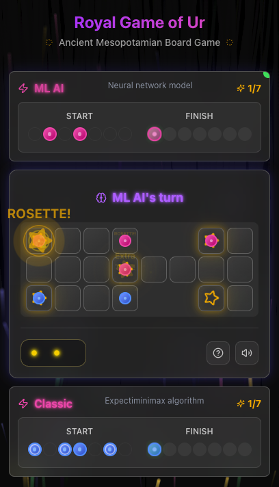

# 🏺 Royal Game of Ur - Cloudflare Edition

A modern implementation of the ancient Mesopotamian board game, "The Royal Game of Ur," built with Next.js and TypeScript, and powered by a unique dual AI engine written in Rust.

This project is a Progressive Web App (PWA), allowing for installation on your device for a native-like experience with offline capabilities.

[](https://github.com/rgilks/rgou-cloudflare/actions/workflows/deploy.yml)

<div align="center">
  
</div>

<div align="center">
  <a href='https://ko-fi.com/N4N31DPNUS' target='_blank'></a>
</div>

## 🌟 Features

- **Authentic Gameplay**: A faithful recreation of the 4,500-year-old Royal Game of Ur
- **Dual AI Engine**:
  - **Client AI (Default)**: Rust AI compiled to WebAssembly, running in browser for instant responses and offline play
  - **Server AI (Fallback)**: Same core Rust AI on Cloudflare Workers
- **PWA & Offline Ready**: Installable Progressive Web App with full offline gameplay
- **Modern UI/UX**: Beautiful, responsive interface with smooth animations and sound effects
- **Game Statistics**: Track wins, losses, and win rate across all games
- **Database Integration**: Games are automatically saved to local SQLite (dev) or Cloudflare D1 (production)

## 🎯 Game Rules

The Royal Game of Ur is a 4,500-year-old race game where each player tries to move all 7 pieces around the board and off the finish before their opponent.

**Quick Rules:**

- **Dice**: Roll 4 tetrahedral dice (binary dice). Count marked corners facing up (0-4)
- **Movement**: Move pieces along your designated track from start to finish
- **Combat**: Landing on an opponent's piece sends it back to start (except on rosette squares)
- **Rosettes**: Starred squares are safe zones and grant an extra turn
- **Winning**: First player to move all 7 pieces off the board wins

For complete rules and strategy, see [Game Rules and Strategy](./docs/game-rules-strategy.md).

## 🏗️ Architecture

This project uses a unique dual-AI architecture with shared Rust AI core:

- **Client AI (Default)**: Rust AI compiled to **WebAssembly** runs in browser with 6-ply search depth
- **Server AI (Fallback)**: Same Rust AI on **Cloudflare Workers** with 4-ply search depth
- **Shared Core**: Both AIs use identical logic from `worker/rust_ai_core` for consistent behavior

The AI uses the **Expectiminimax** algorithm for games with chance elements (dice rolls), combining minimax search with expectation nodes for probabilistic outcomes.

For detailed technical information, see [AI System Documentation](./docs/ai-system.md) and [Architecture Overview](./docs/architecture-overview.md).

## 🛠️ Tech Stack

- **Frontend**: Next.js, React, TypeScript, Tailwind CSS
- **PWA**: Service Worker, Web App Manifest
- **AI Engine**: Rust (Cloudflare Worker) & Rust compiled to WebAssembly (Client)
- **Database**: SQLite (local) / Cloudflare D1 (production)
- **State Management**: Zustand with Immer
- **Deployment**: Cloudflare Workers & Pages

## 📚 Documentation

- **[Documentation Index](./docs/README.md)**: Complete guide to all documentation
- **[Architecture Overview](./docs/architecture-overview.md)**: System design and component interactions
- **[AI System Documentation](./docs/ai-system.md)**: AI algorithm, evaluation function, and technical implementation
- **[Technical Implementation Guide](./docs/technical-implementation.md)**: Development setup and build process
- **[Game Rules and Strategy](./docs/game-rules-strategy.md)**: Complete rules and strategic guidance
- **[Testing Strategy](./docs/testing-strategy.md)**: Testing approach and guidelines

## 🚀 Getting Started

### Prerequisites

- **Git** – [Download Git](https://git-scm.com/downloads)
- **Node.js (v18+)** – [Download Node.js](https://nodejs.org/)
- **Rust & Cargo** – [Install Rust](https://www.rust-lang.org/tools/install)
- **wasm-pack** – `cargo install wasm-pack`
- **worker-build** – `cargo install worker-build`

### Local Development

1. **Clone and install dependencies**

   ```bash
   git clone <repository-url>
   cd rgou-cloudflare
   npm install
   ```

2. **Set up local database**

   ```bash
   npm run migrate:local
   ```

3. **Start development server**
   ```bash
   npm run dev
   ```

The game will open at http://localhost:3000 with full database functionality.

### Deploy to Cloudflare

1. **Install Wrangler CLI**

   ```bash
   npm install -g wrangler
   wrangler login
   ```

2. **Create D1 Database**
   - Go to Cloudflare dashboard → "Workers & Pages" → "D1"
   - Create database named `rgou-db`
   - Copy database ID

3. **Configure environment**

   ```bash
   # Create .env.local
   CLOUDFLARE_ACCOUNT_ID=your_account_id
   D1_DATABASE_ID=your_database_id
   ```

4. **Update wrangler.toml** with your account and database IDs

5. **Deploy**
   ```bash
   npm run migrate:d1
   npm run build
   npx wrangler deploy
   ```

### GitHub Actions Deployment

1. **Create Cloudflare API Token** with Pages and Workers permissions
2. **Add GitHub Secrets**:
   - `CLOUDFLARE_API_TOKEN`
   - `CLOUDFLARE_ACCOUNT_ID`
3. **Push to main branch** - automatic deployment will trigger

## 🧪 Testing

```bash
# Run all tests (including Rust)
npm run check

# Unit tests only
npm run test

# E2E tests
npm run test:e2e
```

## 🔧 Troubleshooting

### Database Issues

If you encounter "Failed to save game" errors:

1. **Check migrations**: `npx wrangler d1 migrations list rgou-db --remote`
2. **Apply pending migrations**: `npx wrangler d1 migrations apply rgou-db --remote`
3. **Verify tables**: `npx wrangler d1 execute rgou-db --remote --command="SELECT name FROM sqlite_master WHERE type='table';"`

### Common Issues

- **"DB binding is not available"**: Check `wrangler.toml` configuration
- **"Invalid game data"**: Check browser console for validation errors
- **WASM loading issues**: Verify CORS headers in `public/_headers`

## 📄 License

This project is open source. See [LICENSE](LICENSE) for details.

## 🤝 Contributing

1. Fork the repository
2. Create a feature branch
3. Make your changes
4. Run `npm run check` to ensure all tests pass
5. Submit a pull request

## 🔗 Resources

- **British Museum**: [Original game artifacts](https://www.britishmuseum.org/collection/object/W_1928-1010-378)
- **Metropolitan Museum**: [Historical game pieces](https://www.metmuseum.org/art/collection/search/329072)
- **University of Pennsylvania**: [Archaeological findings](https://www.penn.museum/collections/object/30-12-702)
