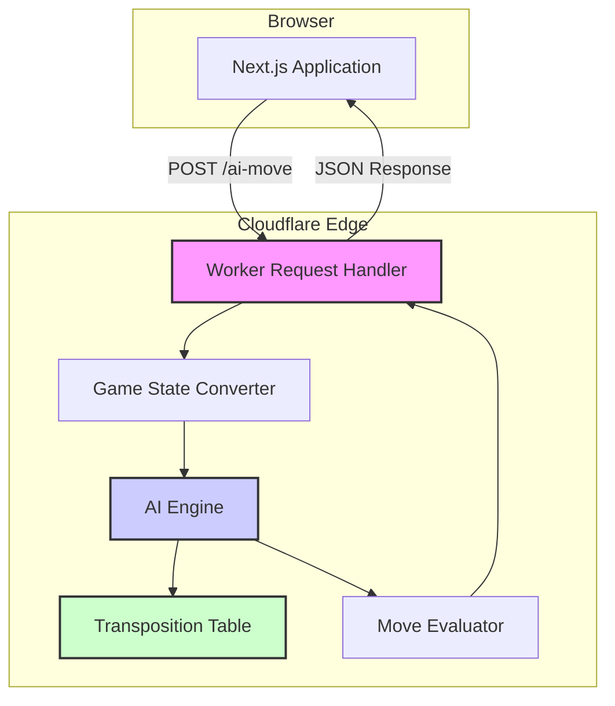

# Cloudflare Worker AI Implementation

This document provides a comprehensive overview of the Cloudflare Worker implementation for the Royal Game of Ur AI, written in Rust and compiled to WebAssembly.

## Table of Contents

- [Overview](#overview)
- [Architecture](#architecture)
- [Project Structure](#project-structure)
- [Worker Logic (`src/lib.rs`)](#worker-logic-srclibrs)
  - [Endpoints](#endpoints)
  - [CORS Handling](#cors-handling)
  - [Request Processing](#request-processing)
- [AI Implementation in Rust](#ai-implementation-in-rust)
  - [Game State Management](#game-state-management)
  - [Minimax Algorithm](#minimax-algorithm)
  - [Evaluation Function](#evaluation-function)
  - [Performance Optimizations](#performance-optimizations)
- [Build Process](#build-process)
- [Deployment](#deployment)

## Overview

The Cloudflare Worker serves as a high-performance backend for the Royal Game of Ur, providing an intelligent AI opponent. It exposes REST API endpoints that, given a game state, return the AI's best move along with detailed diagnostics. The core AI logic is written in Rust and compiled to WebAssembly (Wasm) for optimal performance on the Cloudflare Workers platform.

## Architecture

The architecture consists of a single Rust-based Cloudflare Worker that handles:

1. **HTTP Request Processing**: Handles incoming API requests with CORS support
2. **Game State Management**: Converts between JSON and internal game representations
3. **AI Engine**: Advanced minimax algorithm with alpha-beta pruning and transposition tables
4. **Response Generation**: Returns structured responses with move analysis and diagnostics



## Project Structure

The server-side AI consists of two main parts: a shared core AI engine and a worker-specific wrapper.

```
worker/
├── rust_ai_core/           # SHARED: Core Rust AI logic (minimax, evaluation)
│   └── src/lib.rs
├── src/                    # Worker-specific Rust code
│   └── lib.rs              # Handles HTTP requests, JSON, and calls core AI
├── Cargo.toml              # Rust dependencies for the worker
└── wrangler.toml           # Cloudflare Worker configuration
```

## Worker Logic (`src/lib.rs`)

The entry point for the worker is `worker/src/lib.rs`. Its primary responsibility is to handle HTTP requests, deserialize the game state from JSON, call the core AI logic from the `rust_ai_core` crate, and serialize the resulting move back into a JSON response. It acts as the bridge between the web and the AI engine.

The core AI implementation, including the minimax algorithm and evaluation function, resides in `worker/rust_ai_core/src/lib.rs`. This crate is compiled to WebAssembly for both the server-side worker and the client-side PWA.

### Endpoints

#### `POST /ai-move`

- **Purpose**: Calculate the best move for the AI player
- **Input**: JSON game state with piece positions, current player, and dice roll
- **Output**: Detailed response with move selection, evaluation, and diagnostics
- **Features**:
  - Advanced minimax search (depth 8)
  - Move evaluation and ranking
  - Performance timing metrics
  - Strategic analysis

#### `GET /health`

- **Purpose**: Health monitoring and service verification
- **Output**: Service status, timestamp, and version information

### CORS Handling

The worker includes comprehensive CORS support:

```rust
fn cors_headers() -> Headers {
    let mut headers = Headers::new();
    headers.set("Access-Control-Allow-Origin", "*").unwrap();
    headers.set("Access-Control-Allow-Methods", "GET, POST, OPTIONS").unwrap();
    headers.set("Access-Control-Allow-Headers", "Content-Type, Authorization").unwrap();
    headers.set("Access-Control-Max-Age", "86400").unwrap();
    headers
}
```

### Request Processing

The worker processes requests through several stages:

1. **CORS Preflight**: Handle OPTIONS requests
2. **Route Matching**: Direct requests to appropriate handlers
3. **Input Validation**: Validate and parse JSON game states
4. **AI Computation**: Execute minimax algorithm
5. **Response Generation**: Format detailed JSON responses

## AI Implementation in Rust

### Game State Management

The AI uses efficient Rust structs to represent the game:

```rust
#[derive(Clone, Debug)]
struct GameState {
    board: [Option<PiecePosition>; BOARD_SIZE],
    player1_pieces: [PiecePosition; PIECES_PER_PLAYER],
    player2_pieces: [PiecePosition; PIECES_PER_PLAYER],
    current_player: Player,
    dice_roll: u8,
}

#[derive(Clone, Copy, Debug)]
struct PiecePosition {
    square: i8,
    player: Player,
}
```

Key features:

- **Memory Efficient**: Fixed-size arrays for optimal performance
- **Type Safety**: Strong typing prevents common errors
- **Board Representation**: Dual representation for fast lookups

### Minimax Algorithm

The AI implements an advanced minimax algorithm with several optimizations:

```rust
fn minimax(
    &mut self,
    state: &GameState,
    depth: u8,
    is_maximizing: bool,
    mut alpha: i32,
    mut beta: i32,
) -> i32
```

**Key Features:**

1. **Alpha-Beta Pruning**: Eliminates ~50% of search branches
2. **Transposition Tables**: Caches positions for 50-70% performance improvement
3. **Move Ordering**: Prioritizes promising moves for better pruning
4. **Depth-8 Search**: Deep tactical analysis
5. **Probabilistic Evaluation**: Uses correct dice probabilities

### Evaluation Function

The evaluation function considers multiple strategic factors:

#### Primary Factors (High Weight)

- **Game-Ending Conditions**: ±10,000 points for wins/losses
- **Finished Pieces**: 1,000 points per completed piece
- **Rosette Control**: 40 points for safe square occupation

#### Secondary Factors (Medium Weight)

- **Blocking Potential**: 30 points for tactical positioning
- **Safety Bonuses**: 25 points for pieces on rosettes
- **Position Advancement**: 15 points weighted by track position

#### Tertiary Factors (Low Weight)

- **General Advancement**: 5 points for forward progress
- **Board Control**: Strategic positioning evaluation

### Performance Optimizations

#### Transposition Tables

```rust
struct TranspositionEntry {
    evaluation: i32,
    depth: u8,
    best_move: Option<u8>,
}
```

- **Capacity**: 10,000 entries with intelligent replacement
- **Hit Rate**: Typically 60-80% in middle game
- **Performance Gain**: 50-70% faster computation

#### Move Ordering

Moves are prioritized for optimal alpha-beta pruning:

1. **Immediate Wins** (+100 priority)
2. **Captures** (+50 priority)
3. **Rosette Moves** (+30 priority)
4. **Advancement** (+10 priority)
5. **Other Moves** (base priority)

#### Mathematical Dice Probabilities

Uses the correct Royal Game of Ur dice distribution:

```rust
const DICE_PROBABILITIES: [f32; 5] = [
    1.0/16.0,  // 0: 6.25%
    4.0/16.0,  // 1: 25.0%
    6.0/16.0,  // 2: 37.5%
    4.0/16.0,  // 3: 25.0%
    1.0/16.0,  // 4: 6.25%
];
```

## Build Process

### Rust-to-Wasm Compilation

The build process uses `worker-build` to compile Rust to WebAssembly:

```toml
[build]
command = "cargo install -q worker-build && worker-build --release"
```

**Build Steps:**

1. **Dependency Resolution**: Cargo resolves and downloads dependencies
2. **Rust Compilation**: Code compiled to WebAssembly
3. **Worker Shim Generation**: Creates JavaScript wrapper for Wasm module
4. **Optimization**: Release build with size and speed optimizations

### Dependencies

Key Rust dependencies:

- **`worker`**: Cloudflare Workers runtime bindings
- **`serde`**: JSON serialization/deserialization
- **`std::collections::HashMap`**: For transposition tables

## Deployment

### Configuration

The worker is configured via `wrangler.toml`:

```toml
name = "rgou-ai-worker"
main = "build/worker/shim.mjs"
compatibility_date = "2024-12-01"
account_id = "571f130502618993d848f58d27ae288d"

[build]
command = "cargo install -q worker-build && worker-build --release"

[env.production.vars]
ENVIRONMENT = "production"
```

### Deployment Commands

```bash
# Development
cd worker
wrangler dev

# Production deployment
wrangler deploy
```

### Environment Variables

- **`ENVIRONMENT`**: Set to "production" for production builds
- **`API_SECRET`**: Optional authentication token (if implemented)

## Performance Characteristics

### Typical Performance Metrics

- **Average Response Time**: 45-80ms
- **AI Calculation Time**: 30-60ms
- **Search Depth**: 8 levels
- **Nodes Evaluated**: 1,000-3,000 per move
- **Transposition Hit Rate**: 60-80%
- **Memory Usage**: ~2MB working set

### Optimization Results

Compared to naive minimax implementation:

- **50-70% faster** with transposition tables
- **90% fewer nodes** evaluated with alpha-beta pruning
- **Mathematically correct** probability-weighted decisions

## Error Handling

The worker includes comprehensive error handling:

```rust
struct ErrorResponse {
    error: String,
    message: Option<String>,
}
```

**Error Types:**

- **Invalid JSON**: Malformed request bodies
- **Game State Errors**: Invalid piece positions or game states
- **AI Computation Errors**: Internal calculation failures
- **Timeout Errors**: Computation time limits exceeded

## Monitoring and Diagnostics

Each AI response includes detailed diagnostics:

```rust
struct Diagnostics {
    search_depth: u8,
    valid_moves: Vec<u8>,
    move_evaluations: Vec<MoveEvaluation>,
    transposition_hits: usize,
    nodes_evaluated: u32,
    game_phase: String,
    board_control: i32,
    piece_positions: PiecePositions,
}
```

This enables:

- **Performance Monitoring**: Track computation efficiency
- **AI Behavior Analysis**: Understand decision-making process
- **Game Analysis**: Strategic insights and move explanations
- **Debugging Support**: Detailed state information for troubleshooting
