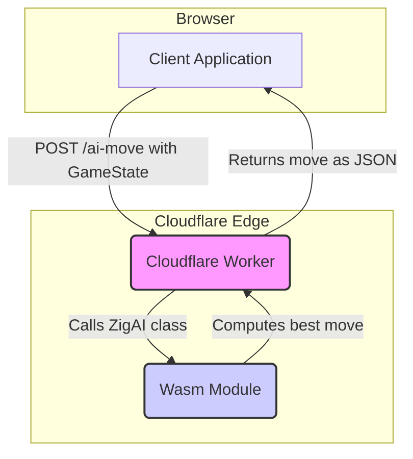

# Cloudflare Worker AI Implementation

This document provides a comprehensive overview of the Cloudflare Worker implementation for the Royal Game of Ur AI.

## Table of Contents

- [Overview](#overview)
- [Architecture](#architecture)
- [Project Structure](#project-structure)
- [Worker Logic (`src/index.ts`)](#worker-logic-srcindexts)
  - [Endpoints](#endpoints)
  - [Authentication](#authentication)
  - [CORS Handling](#cors-handling)
- [WebAssembly Interface (`src/ai-wasm.ts`)](#webassembly-interface-srcai-wasmts)
  - [Wasm Initialization](#wasm-initialization)
  - [The `ZigAI` Class](#the-zigai-class)
- [AI Implementation in Zig (`src/ai.zig`)](#ai-implementation-in-zig-srcaizig)
  - [Game State](#game-state)
  - [AI Algorithm](#ai-algorithm)
  - [Exported Functions](#exported-functions)
- [Build Process (`build.zig`)](#build-process-buildzig)

## Overview

The Cloudflare Worker serves as a backend for the Royal Game of Ur, providing an AI opponent. It exposes an API endpoint that, given a game state, returns the AI's best move. The core AI logic is written in Zig and compiled to WebAssembly (Wasm) for performance and portability.

## Architecture

The architecture consists of three main parts:

1.  **Cloudflare Worker (`src/index.ts`):** A TypeScript-based worker that handles incoming HTTP requests, authentication, and communication with the Wasm module.
2.  **Wasm Interface (`src/ai-wasm.ts`):** A TypeScript module that acts as a bridge, loading the Wasm module and providing a clean interface (`ZigAI` class) for the worker to interact with it.
3.  **Zig Wasm Module (`src/ai.zig`):** The heart of the AI. It contains the game logic, a game state evaluation function, and a minimax algorithm to determine the best move.

## Project Structure

The relevant files are located in the `worker/` directory:

- `wrangler.toml`: Configuration for the Cloudflare Worker.
- `src/index.ts`: The worker's entry point.
- `src/ai-wasm.ts`: The JavaScript/TypeScript interface to the Wasm module.
- `src/ai.wasm`: The compiled WebAssembly module.
- `src/ai.zig`: The Zig source code for the AI logic.
- `build.zig`: The build script for compiling the Zig code to Wasm.

## Worker Logic (`src/index.ts`)

The main worker script handles the business logic of the API.

### Endpoints

- `POST /ai-move`:
  - Accepts a JSON object representing the current `GameState`.
  - Initializes the Wasm module and the `ZigAI` class.
  - Passes the game state to the Wasm module to calculate the AI's move.
  - Returns the calculated move, along with performance timings.
- `GET /health`:
  - A simple health check endpoint that returns the worker's status and version.

### Authentication

The worker protects the `/ai-move` endpoint using a bearer token. The client must provide an `Authorization` header with a secret token that matches the `API_SECRET` environment variable defined in `wrangler.toml`.

### CORS Handling

The worker includes headers to handle Cross-Origin Resource Sharing (CORS), allowing requests from any origin. It correctly handles `OPTIONS` preflight requests.

## WebAssembly Interface (`src/ai-wasm.ts`)

This file is the glue between the TypeScript world of the Cloudflare Worker and the Wasm world of the AI logic.

### Wasm Initialization

The `initializeWasm` function handles loading and instantiating the `ai.wasm` module. It uses ES module imports to load the Wasm file directly. It also sets up an import object that allows the Wasm module to call JavaScript functions (e.g., `js_log` for logging to the console).

### The `ZigAI` Class

The `ZigAI` class provides a high-level abstraction over the Wasm module's exported functions.

- **`constructor(wasm)`**:
  - Takes the instantiated Wasm exports as an argument.
  - Calls the exported `createGameState` Wasm function to allocate memory for a new game state inside the Wasm instance.
  - Allocates memory for the player pieces using the exported `wasm_alloc` function.
- **`updateGameState(gameState)`**:
  - Takes a JavaScript `GameState` object.
  - Copies the piece positions from the JavaScript object into the Wasm memory, writing to the pointers allocated in the constructor.
  - Calls the exported `updateGameState` Wasm function to update the internal state in the Wasm module.
- **`getAIMove()`**:
  - Calls the exported `getAIMove` Wasm function, which runs the AI algorithm and returns the best move.
- **`destroy()`**:
  - Calls the exported `destroyGameState` and `wasm_free` functions to release the memory that was allocated in the Wasm instance, preventing memory leaks.

## AI Implementation in Zig (`src/ai.zig`)

The Zig code contains the core logic for the Royal Game of Ur AI. It is compiled to Wasm for high performance.

### Game State

A `GameState` struct in Zig mirrors the structure in TypeScript. It holds the board state, piece locations, the current player, and the current dice roll. The code includes functions to validate and apply moves according to the game's rules.

### AI Algorithm

The AI uses a **minimax algorithm with alpha-beta pruning** to search for the optimal move.

- **Evaluation Function**: The `evaluate` function assigns a score to a given game state from the perspective of the AI (Player 2). The score is calculated based on:
  - **Finished Pieces**: A large bonus is given for each piece that has successfully exited the board. This is the primary factor.
  - **Piece Advancement**: A smaller bonus is given for how far each piece has advanced along its track.
- **Minimax Search**:
  - The `getBestMove` function initiates the search.
  - The `minimax` function recursively explores the game tree up to a `MAX_DEPTH` of 6.
  - It simulates potential dice rolls for the opponent's turn to make a more robust decision.
  - Alpha-beta pruning is used to cut off branches of the search tree that are not promising, significantly speeding up the search.

### Exported Functions

The Zig code exports several functions that are called by the `ZigAI` class in TypeScript:

- `createGameState()`: Allocates and initializes a `GameState` struct.
- `destroyGameState(*GameState)`: Frees the memory for a `GameState`.
- `updateGameState(...)`: Updates the Wasm game state from data provided by JS.
- `getAIMove(*GameState)`: The main entry point to run the AI search.
- `wasm_alloc(usize)` / `wasm_free(*u8, usize)`: General-purpose memory allocators for the JS side to use.

## Build Process (`build.zig`)

The `build.zig` file is a script that tells the Zig compiler how to build the project.

- It targets `wasm32-freestanding`, which is the standard for WebAssembly.
- It compiles `src/ai.zig` into an executable artifact.
- The settings `entry = .disabled` and `rdynamic = true` are used to create a Wasm library (as opposed to a standalone application), making its functions available for import by the JavaScript host environment.
- The output is the `ai.wasm` file, which is then imported by `ai-wasm.ts`.
