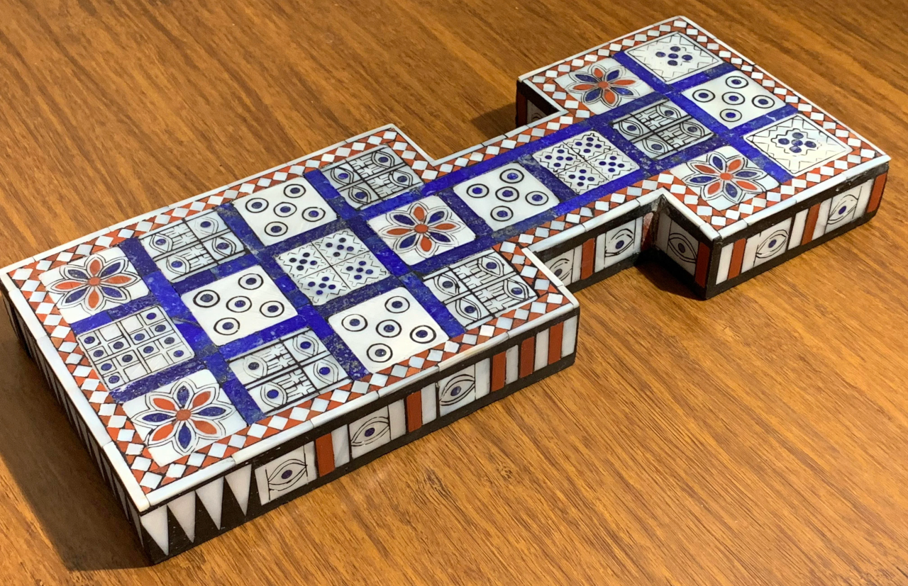
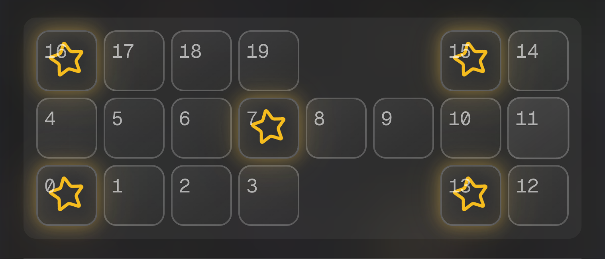

# Game Rules and Strategy Guide

## Historical Context

The Royal Game of Ur is one of the oldest known board games, dating back to approximately 2500 BCE in ancient Mesopotamia. It was discovered in the Royal Cemetery of Ur (modern-day Iraq) by archaeologist Sir Leonard Woolley in the 1920s.

The game was played by royalty and commoners alike, and evidence suggests it was popular across the ancient Near East for over 3000 years. The rules were reconstructed based on archaeological findings and cuneiform texts.

## Game Overview

The Royal Game of Ur is a **race game** where two players compete to move all seven of their pieces around the board and off the finish line before their opponent. The game combines elements of luck (dice rolls) with strategic decision-making.

## Board Layout

The game board consists of 20 squares arranged in a distinctive pattern:

  
  

### Key Board Features

- **Starting Areas**: Players begin with pieces off the board
- **Shared Center Lane**: Squares 4-11 are shared by both players
- **Rosette Squares**: Special squares marked with stars (0, 7, 13, 15, 16)
- **Finish Line**: Square 20 (off the board)

### Player Tracks

**Player 1 (Human)**: 3 → 2 → 1 → 0 → 4 → 5 → 6 → 7 → 8 → 9 → 10 → 11 → 12 → 13 → 20

**Player 2 (AI)**: 19 → 18 → 17 → 16 → 4 → 5 → 6 → 7 → 8 → 9 → 10 → 11 → 14 → 15 → 20

## Game Rules

### 1. Setup

- Each player has 7 pieces, initially off the board
- Players take turns rolling dice and moving pieces
- The goal is to move all pieces to the finish line (square 20)

### 2. Dice Mechanics

The game uses **4 tetrahedral dice** (pyramid-shaped dice with 4 faces):

- Each die has 2 marked corners and 2 unmarked corners
- Roll all 4 dice simultaneously
- Count the number of marked corners facing up
- Result: 0, 1, 2, 3, or 4

#### Dice Probabilities

| Roll | Probability | Frequency |
| ---- | ----------- | --------- |
| 0    | 6.25%       | 1 in 16   |
| 1    | 25%         | 4 in 16   |
| 2    | 37.5%       | 6 in 16   |
| 3    | 25%         | 4 in 16   |
| 4    | 6.25%       | 1 in 16   |

### 3. Movement Rules

#### Basic Movement

1. **Roll the dice** to determine how many squares to move
2. **Choose a piece** to move (if you have valid moves)
3. **Move the piece** along your designated track
4. **Apply special rules** (rosettes, captures, etc.)

#### Valid Moves

- **From Start**: Move a piece from off-board to your starting square
- **On Board**: Move a piece along your track by the dice roll value
- **To Finish**: Move a piece exactly to the finish line (square 20)

#### Invalid Moves

- Moving beyond the finish line
- Moving to a square occupied by your own piece
- Moving to a square occupied by an opponent's piece on a rosette

### 4. Special Rules

#### Rosette Squares

Rosette squares (0, 7, 13, 15, 16) provide special benefits:

- **Safety**: Pieces on rosette squares cannot be captured
- **Extra Turn**: Landing on a rosette grants an additional turn
- **Strategic Value**: Control of rosettes is crucial for winning

#### Captures

- **Landing on an opponent's piece** sends it back to the start
- **Exception**: Pieces on rosette squares are safe from capture
- **Strategic Impact**: Captures can dramatically change game momentum

#### Roll of Zero

- Rolling 0 means **no movement** is possible
- **Pass turn** to the opponent
- This adds a significant luck element to the game

### 5. Winning Conditions

The first player to move **all 7 pieces** to the finish line (square 20) wins the game.

## Strategic Considerations

### Opening Strategy

#### Early Game (Moves 1-10)

1. **Get Pieces on Board**: Prioritize moving pieces from start to board
2. **Control Rosettes**: Aim to occupy rosette squares when possible
3. **Avoid Clustering**: Don't bunch pieces together, making them vulnerable
4. **Diversify Threats**: Spread pieces across different track positions

#### Key Opening Principles

- **Rosette Priority**: Squares 7 and 13 are particularly valuable
- **Center Lane Control**: The shared center lane (4-11) is crucial
- **Flexibility**: Keep multiple move options available

### Mid-Game Strategy

#### Position Management

1. **Rosette Control**: Maintain control of key rosette squares
2. **Capture Opportunities**: Look for chances to capture opponent pieces
3. **Blocking**: Use pieces to block opponent's progress
4. **Advancement**: Continue moving pieces toward the finish

#### Strategic Considerations

- **Risk vs. Reward**: Balance aggressive moves with safety
- **Timing**: Know when to advance pieces vs. when to defend
- **Opponent Analysis**: Anticipate opponent's likely moves

### End-Game Strategy

#### Race to Finish

1. **Prioritize Finishing**: Focus on getting pieces to the finish line
2. **Defensive Play**: Protect pieces near the finish from capture
3. **Blocking**: Prevent opponent from finishing their pieces
4. **Efficiency**: Use each move to maximum effect

#### Critical End-Game Positions

- **6-7 pieces finished**: Race becomes critical
- **Last piece**: Often determines the winner
- **Capture opportunities**: Can swing the game dramatically

## Advanced Tactics

### Rosette Strategy

#### Rosette Value Hierarchy

1. **Square 7**: Most valuable (center lane, early access)
2. **Square 13**: High value (near finish, safe position)
3. **Square 15**: Good value (near finish)
4. **Square 0**: Moderate value (starting area)
5. **Square 16**: Lower value (starting area)

#### Rosette Control Tactics

- **Early Occupation**: Secure rosettes early in the game
- **Defensive Positioning**: Use rosettes to protect vulnerable pieces
- **Offensive Base**: Use rosettes as launching points for attacks

### Capture Strategy

#### When to Capture

- **High-Value Targets**: Capture pieces near the finish line
- **Rosette Denial**: Capture pieces that could reach rosettes
- **Momentum Swing**: Use captures to change game flow

#### When to Avoid Captures

- **Vulnerable Position**: Don't expose your piece to counter-capture
- **Better Alternatives**: Sometimes advancing is better than capturing
- **End-Game**: Focus on finishing rather than capturing

### Dice Roll Management

#### Roll of Zero Strategy

- **Plan Ahead**: Have backup plans for when you roll zero
- **Position Pieces**: Ensure pieces are in good positions even if you miss a turn
- **Opponent Pressure**: Use zero rolls to your advantage by positioning defensively

#### High Roll Strategy

- **Finishing Moves**: Use high rolls (3-4) to finish pieces
- **Rosette Access**: Use high rolls to reach valuable rosettes
- **Capture Opportunities**: Use high rolls to reach opponent pieces

## Common Mistakes to Avoid

### Strategic Errors

1. **Ignoring Rosettes**: Failing to prioritize rosette control
2. **Over-Aggression**: Making risky captures that expose your pieces
3. **Poor Positioning**: Bunching pieces together or leaving them vulnerable
4. **Ignoring Opponent**: Not considering opponent's likely responses

### Tactical Errors

1. **Wasting High Rolls**: Using high dice rolls for low-value moves
2. **Poor Timing**: Advancing pieces at the wrong time
3. **Missing Captures**: Failing to take advantage of capture opportunities
4. **Inefficient Movement**: Not maximizing the value of each move

## AI Behavior Analysis

### AI Strengths

- **Deep Calculation**: Evaluates positions 6 moves ahead
- **Positional Understanding**: Excellent grasp of strategic concepts
- **Consistent Play**: Makes few tactical mistakes
- **End-Game Skill**: Strong in critical end-game positions

### AI Tendencies

- **Rosette Focus**: Prioritizes rosette control
- **Defensive Play**: Prefers safe moves over risky captures
- **Efficient Movement**: Maximizes the value of each move
- **Patient Strategy**: Willing to wait for better opportunities

### Exploiting AI Weaknesses

- **Aggressive Play**: The AI can be overly cautious
- **Surprise Tactics**: Unusual move sequences can catch the AI off guard
- **End-Game Pressure**: The AI may make suboptimal moves under pressure

## Historical Significance

### Cultural Impact

The Royal Game of Ur provides insight into:

- **Ancient Mathematics**: Understanding of probability and counting
- **Social Structure**: Games as markers of status and skill
- **Trade Networks**: Game spread across the ancient world
- **Cognitive Development**: Strategic thinking in ancient societies

### Archaeological Discoveries

- **Royal Cemetery of Ur**: Original game boards and pieces
- **Cuneiform Texts**: References to game rules and strategies
- **Wide Distribution**: Evidence of play across Mesopotamia
- **Longevity**: Game remained popular for over 3000 years

## Modern Relevance

### Educational Value

The game teaches:

- **Probability**: Understanding dice roll distributions
- **Strategic Thinking**: Planning multiple moves ahead
- **Risk Assessment**: Balancing aggression with safety
- **Pattern Recognition**: Identifying key board positions

### Cognitive Benefits

- **Decision Making**: Evaluating multiple options
- **Spatial Reasoning**: Understanding board geometry
- **Memory**: Tracking piece positions and game state
- **Patience**: Waiting for optimal opportunities

## References and Further Reading

### Academic Sources

1. **Finkel, I. L.** (2007). "On the rules for the Royal Game of Ur." _Ancient Board Games in Perspective_, 16-32.

2. **Bell, R. C.** (1979). _Board and Table Games from Many Civilizations_. Dover Publications.

3. **Murray, H. J. R.** (1952). _A History of Board-Games Other Than Chess_. Oxford University Press.

### Online Resources

- [British Museum Collection](https://www.britishmuseum.org/collection/object/W_1928-1010-378)
- [Metropolitan Museum of Art](https://www.metmuseum.org/art/collection/search/329190)
- [University of Pennsylvania Museum](https://www.penn.museum/collections/object/142)

### Game Theory Analysis

For mathematical analysis of the game's strategic elements, see the [AI System Documentation](./ai-system.md) for technical details on the expectiminimax algorithm and evaluation function.
